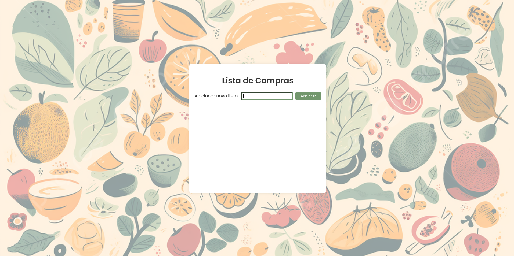
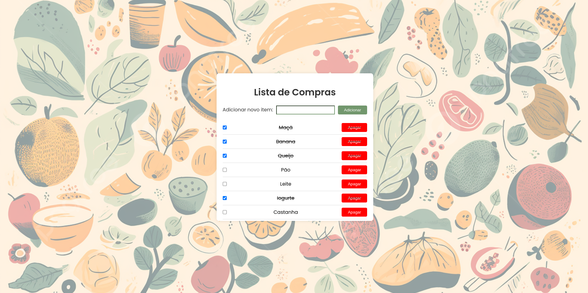

# Lista de Compras

## Projeto criado com ReactJs e Typescript. Os itens desejados podem ser inseridos, removidos e marcados com o checklist.

  
  

# Funcionalidades

* Adicionar produto na lista

* Excluir produto

* Marca produto com checklist

# Tecnologias Utilizadas

* ReactJS - Para construção da interface

* CSS - Para estilização da interface

* React Hooks - Para gerenciamento de estado

# Conceitos Abordados

Componentização

# Como utilizar

1- Clone o projeto
`git@github.com:helen-andrade/shopping-list.git`

2- Instale as dependências
`npm i`

3- Rode o script de desenvolvimento
`npm run dev`

---

    
Feito com ♡ por Helen Andrade

